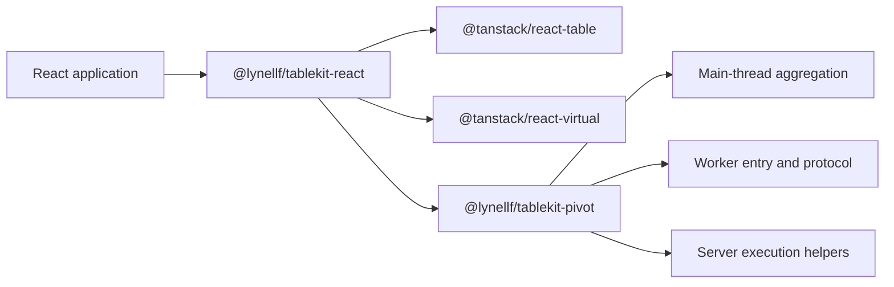

# TableKit TanStack Architecture Reset Plan

## Status

Completed on 2026-07-26.

## Implementation Result

- The workspace now contains only `@lynellf/tablekit-pivot` and
  `@lynellf/tablekit-react`.
- `DataGrid` uses TanStack Table and TanStack Virtual for its supported client
  and server product paths.
- `PivotGrid` keeps framework-free aggregation in the pivot package while
  using TanStack Table for rendered expansion and TanStack Virtual for rows and
  center columns.
- Worker protocol, worker entry, and server execution ship from pivot
  subpaths.
- The owned core, standalone worker package, legacy pivot facade, v2 headless
  React hooks, compatibility fixtures, and obsolete example hosts were
  deleted.
- `pnpm verify`, both eight-scenario Storybook browser commands,
  packed-artifact checks, and v3 public-surface checks pass.

The task checklists below are retained as the original review contract; this
result section is the implementation closeout record.

## Objective

Replace TableKit's owned table state, row-model, and virtualization engine with
TanStack Table and TanStack Virtual; retain the framework-free pivot algorithms
and execution contracts; deliver batteries-included React `DataGrid` and
`PivotGrid` components; and reduce the workspace to two publishable packages.

This is a direct architectural reset. It does not include a deprecation period,
compatibility facade, or migration support for hypothetical consumers.

## Review Summary

Approval of this plan approves these choices:

1. Keep the pnpm workspace with two publishable packages: pivot and React.
2. Fold worker and server execution into pivot subpaths.
3. Delete `tablekit-core` and `tablekit-worker` without compatibility packages.
4. Remove v2 headless React hooks and core re-exports from the supported API.
5. Use TanStack types directly where a TableKit type would merely duplicate
   TanStack.
6. Release the completed reset as v3.0.0.
7. Keep consuming applications and an imperative renderer out of scope.

| Phase | Outcome |
| --- | --- |
| 0 | Accept the architecture decision and v3 component contract |
| 1 | Replace the DataGrid engine, virtualization, and server-state plumbing |
| 2 | Isolate the pivot engine and rebuild PivotGrid on TanStack |
| 3 | Fold worker/server execution into the pivot package |
| 4 | Delete the legacy headless layers and `tablekit-core` |
| 5 | Rebuild examples/docs, package v3, and run complete verification |

## Target Architecture



### Publishable packages

| Package | Owns | Does not own |
| --- | --- | --- |
| `@lynellf/tablekit-pivot` | Pivot config, queries, aggregators, tree construction, totals, serialization, main-thread/worker/server execution | React, DOM rendering, focus, announcers, generic table state, generic virtualization |
| `@lynellf/tablekit-react` | Drop-in DataGrid/PivotGrid, rendering, defaults, accessibility, events, controls, server-data orchestration, pivot adaptation | Generic row pipelines, cloned TanStack state models, pivot aggregation algorithms |

### Final export posture

`@lynellf/tablekit-pivot`:

- `.`
- `./aggregators`
- `./engine`
- `./serialize`
- `./worker`
- `./worker/entry`
- `./worker/protocol`
- `./server`

`@lynellf/tablekit-react`:

- `.`
- `./validate` only if the validator remains product-relevant
- `./styles.css`

The following packages and subpaths will not exist in v3:

- `@lynellf/tablekit-core`
- `@lynellf/tablekit-core/*`
- `@lynellf/tablekit-worker`
- `@lynellf/tablekit-worker/*`
- `@lynellf/tablekit-pivot/pivotTable`

## Product Scope

### DataGrid must provide

- Drop-in client rows and columns.
- TanStack-backed sorting, filtering, pagination, selection, column order,
  visibility, pinning, and sizing.
- Fixed-height row and center-column virtualization using TanStack Virtual.
- Controlled and uncontrolled state where it materially helps component use.
- Row and cell events with complete context.
- Keyboard navigation and accessible grid semantics.
- Loading, empty, error, and retry presentation.
- Server-data mode with abort, stale-result suppression, and retained-data
  loading behavior.
- Opt-in column controls and the existing stable stylesheet entry.

### PivotGrid must provide

- Drop-in pivot configuration over raw rows.
- Main-thread, worker, and server aggregation execution.
- Generated column hierarchy, totals, and multiple measures.
- Expand/collapse over materialized and asynchronously loaded children.
- Pivot sorting and pre-aggregation filtering.
- Fixed-height row and center-column virtualization using TanStack Virtual.
- Pinned generated groups and a fixed row-header region.
- Accessible treegrid semantics and keyboard behavior.
- Loading, empty, root-error, child-error, and retry presentation.
- Field configuration controls.
- Row/cell events and imperative grid commands with complete pivot context.

### Explicitly out of scope

- Compatibility with the v2 headless API.
- Deprecation wrappers or aliases.
- General consumer migration documentation.
- Work in consuming applications.
- An imperative or custom-element renderer.
- A TableKit-owned replacement for any TanStack table state or row model.
- Variable-height rows unless separately approved after the reset.
- New editing, formulas, charts, range selection, clipboard, or other grid
  features unrelated to the architecture reset.

## Implementation Rules

1. Preserve required rendered component behavior, not legacy headless API
   shapes.
2. Use TanStack types directly for commodity table concepts instead of
   recreating equivalent TableKit types.
3. Keep TableKit-specific props and event contexts only where they create the
   drop-in product experience.
4. Keep pivot engine modules importable in worker and server environments.
5. Do not introduce a temporary public compatibility package. Temporary
   internal adapters are allowed only while a phase is in progress and must be
   deleted before its checkpoint.
6. Each task must leave its scoped tests green. Each phase checkpoint must
   leave the repository buildable.
7. Do not edit archived historical plans merely to make them describe v3.
   Mark active documents as superseded and archive them during closeout.

## Dependency Order

```text
Architecture decision
        |
        +--> React/TanStack product contract
        |        |
        |        +--> DataGrid client state
        |        +--> DataGrid rendering/virtualization
        |        +--> DataGrid server mode
        |
        +--> Framework-free pivot contract
                 |
                 +--> Pivot/TanStack adapter
                 +--> Async pivot orchestration
                 +--> Pivot rendering/virtualization
                 |
                 +--> Worker package consolidation
                          |
                          +--> Delete worker package

DataGrid and PivotGrid no longer import core
        |
        +--> Delete legacy React/headless surfaces
        +--> Delete tablekit-core
        +--> Rebuild examples, packaging, and documentation
```

## Phase 0: Accept the Reset and Establish the Contract

### Task 1: Accept the architecture decision and supersede active v2 direction

**Description:** Approve ADR-0001, change its status to Accepted, and route
active architecture documents away from the owned-core direction without
rewriting historical evidence.

**Acceptance criteria:**

- [x] ADR-0001 is marked Accepted.
- [x] The active v2 assessment and plan clearly point to ADR-0001 as their
      superseding decision.
- [x] Archived documents remain unchanged.

**Verification:**

- [ ] `rg -n "Retain and evolve the owned Table Kit engine" docs` returns only
      historical or explicitly superseded context.
- [ ] Documentation links resolve locally.

**Dependencies:** User approval of this plan.

**Files likely touched:**

- `docs/decisions/0001-adopt-tanstack-and-remove-tablekit-core.md`
- `docs/table-kit-2.0-parity-assessment-and-spec-v2.md`
- `docs/table-kit-2.0-parity-plan/spec.md`

**Estimated scope:** Small.

### Task 2: Define the v3 React component and TanStack dependency contract

**Description:** Add TanStack as the React implementation dependency and define
the v3 component-facing types before replacing behavior. Remove plans for
headless API compatibility. Reuse TanStack column and state types where doing
so avoids a duplicate TableKit model.

**Acceptance criteria:**

- [ ] `@tanstack/react-table` and `@tanstack/react-virtual` are direct
      dependencies of `@lynellf/tablekit-react`.
- [ ] React remains a peer dependency.
- [ ] `DataGridProps` and `PivotGridProps` describe the desired drop-in v3
      surface without importing `tablekit-core`.
- [ ] Type tests cover the minimal client, server, main-thread pivot, and
      worker-pivot component configurations.

**Verification:**

- [ ] `pnpm --filter @lynellf/tablekit-react typecheck`
- [ ] Focused public-surface/type tests pass.

**Dependencies:** Task 1.

**Files likely touched:**

- `packages/react/package.json`
- `packages/react/src/DataGrid.types.ts`
- `packages/react/src/PivotGrid.types.ts`
- `packages/react/src/index.ts`
- `packages/react/src/index.test.ts`

**Estimated scope:** Medium.

### Checkpoint A: Contract review

- [ ] The accepted ADR matches the intended product direction.
- [ ] The proposed v3 component API is reviewable before implementation.
- [ ] No compatibility or consuming-application work has entered scope.

## Phase 1: Replace the DataGrid Engine

### Task 3: Replace the client DataGrid row pipeline with TanStack Table

**Description:** Build the DataGrid table instance with `useReactTable` and
TanStack's client row models. Sorting, filtering, pagination, selection, column
order, visibility, pinning, and sizing must no longer execute through
`createDataTable`.

**Acceptance criteria:**

- [ ] Client rows and columns render from the TanStack row model.
- [ ] Client sorting, filtering, pagination, and selection behavior pass
      focused tests.
- [ ] Controlled and uncontrolled component state use TanStack state and
      callbacks.
- [ ] The new client path imports nothing from `tablekit-core`.

**Verification:**

- [ ] Focused DataGrid and hook tests pass.
- [ ] `rg -n "@lynellf/tablekit-core" packages/react/src/DataGrid*` returns no
      matches.

**Dependencies:** Task 2.

**Files likely touched:**

- `packages/react/src/DataGrid.tsx`
- `packages/react/src/DataGrid.types.ts`
- `packages/react/src/useDataTable.ts` or its replacement
- `packages/react/src/DataGrid.test.tsx`
- `packages/react/src/useDataTable.test.tsx`

**Estimated scope:** Medium.

### Task 4: Port DataGrid controls and interaction behavior

**Description:** Rewire column controls, row/cell events, selection helpers,
imperative handles, and controlled-state callbacks to TanStack APIs. Preserve
TableKit-specific event contexts and simple component props.

**Acceptance criteria:**

- [ ] Column menu actions operate on TanStack columns and state.
- [ ] Selection and imperative handle results match rendered rows.
- [ ] Click and double-click events contain stable row and column identities.
- [ ] No cloned TableKit sorting, filtering, selection, pinning, or sizing state
      remains in the DataGrid path.

**Verification:**

- [ ] Focused column-control, selection, and event tests pass.
- [ ] React public-surface type tests pass.

**Dependencies:** Task 3.

**Files likely touched:**

- `packages/react/src/DataGridColumnMenu.tsx`
- `packages/react/src/DataGrid.tsx`
- `packages/react/src/DataGrid.types.ts`
- `packages/react/src/DataGrid.test.tsx`

**Estimated scope:** Medium.

### Task 5: Replace DataGrid virtualization and focus plumbing

**Description:** Replace `virtualWindow`, core virtualizers, scroll adapters,
and generic core keyboard helpers in the rendered DataGrid with TanStack
Virtual plus React-owned focus policy.

**Acceptance criteria:**

- [ ] Rows and center columns are virtualized with TanStack Virtual.
- [ ] Pinned columns remain mounted outside the virtualized center region.
- [ ] Logical focus remains stable while scrolling both axes.
- [ ] Grid keyboard and Tab behavior pass accessibility tests.
- [ ] DataGrid imports none of the core virtualization or keyboard modules.

**Verification:**

- [ ] Focused virtualized-grid and tab-behavior integration tests pass.
- [ ] DataGrid browser tests prove bounded DOM, frozen geometry, and focus.

**Dependencies:** Task 4.

**Files likely touched:**

- `packages/react/src/DataGrid.tsx`
- `packages/react/src/useKeyboardNav.ts` or its replacement
- `packages/react/src/useTabBehavior.ts`
- `packages/react/src/virtualWindow.ts`
- `packages/react/src/__integration__/virtualized-grid.test.tsx`

**Estimated scope:** Medium.

### Task 6: Rehome server-data orchestration in the React package

**Description:** Move the useful server-data contract and request lifecycle out
of `tablekit-core`. TanStack manual sorting, filtering, and pagination state
will drive React-owned queries. Preserve cancellation, stale-result
suppression, and retained-data loading behavior because TanStack does not own
fetch orchestration.

**Acceptance criteria:**

- [ ] Server-data types and query serialization live in `tablekit-react`.
- [ ] TanStack manual state produces deterministic server requests.
- [ ] Superseded requests abort and stale responses cannot publish.
- [ ] Existing rows remain visible during replacement loading and errors where
      the component contract requires it.
- [ ] Server DataGrid code imports nothing from `tablekit-core/dataSource`.

**Verification:**

- [ ] Server pagination, abort/stale, nullable source, and Strict Mode tests
      pass.
- [ ] Focused browser server-mode scenario passes.

**Dependencies:** Tasks 3 and 4.

**Files likely touched:**

- `packages/react/src/useDataSource.ts`
- `packages/react/src/DataGrid.types.ts`
- new React-owned data-source type/query modules
- `packages/react/src/__integration__/abort-stale.test.tsx`
- `packages/react/src/__integration__/server-pagination.test.tsx`

**Estimated scope:** Medium.

### Checkpoint B: TanStack-backed DataGrid

- [ ] The complete rendered DataGrid path is TanStack-backed.
- [ ] DataGrid behavior and browser evidence pass.
- [ ] DataGrid and server-data source files contain no core imports.
- [ ] The repository still builds with the legacy pivot path temporarily
      present.

## Phase 2: Isolate the Pivot Engine and Replace PivotGrid State

### Task 7: Make the pivot engine contract independent from tablekit-core

**Description:** Separate engine-domain types from the legacy PivotTable
instance and UI state. Keep pivot config, queries, results, nodes,
aggregators, totals, pivot sorting, execution contracts, and serialization.
Remove core-derived focus, sizing, pinning, announcer, updater, and data-source
types from the durable engine surface.

**Acceptance criteria:**

- [ ] Pivot engine and serialization modules compile without `tablekit-core`.
- [ ] `PivotResult`, `PivotRowNode`, and `AggregationEngine` remain
      framework-free.
- [ ] Engine, aggregator, serialization, sorting, lazy-expansion, and totals
      tests pass.
- [ ] UI-only types are either moved to React or marked for deletion with the
      legacy PivotTable layer.

**Verification:**

- [ ] `pnpm --filter @lynellf/tablekit-pivot typecheck`
- [ ] Focused pivot engine test suite passes.
- [ ] `rg -n "@lynellf/tablekit-core" packages/pivot/src/engine packages/pivot/src/aggregators packages/pivot/src/serialize` returns no matches.

**Dependencies:** Task 2.

**Files likely touched:**

- `packages/pivot/src/types.ts`
- pivot engine-domain type modules
- `packages/pivot/src/index.ts`
- `packages/pivot/tsconfig.json`
- `packages/pivot/src/__tests__/types.test.ts`

**Estimated scope:** Medium.

### Task 8: Adapt pivot results to TanStack rows and columns

**Description:** Add a React-owned adapter that converts `PivotResult` into
stable TanStack data and nested column definitions. Use TanStack expansion
state and row models for materialized children while keeping aggregation and
pivot sorting in the pivot engine.

**Acceptance criteria:**

- [ ] Pivot row keys map deterministically to TanStack row IDs.
- [ ] Materialized `children` map through `getSubRows`.
- [ ] Pivot column hierarchy maps to nested TanStack column definitions.
- [ ] Measures, totals, and grand totals retain their stable identities and
      values.
- [ ] No TableKit-owned generic row model is introduced.

**Verification:**

- [ ] Adapter unit tests cover multiple levels, multiple measures, totals, and
      empty results.
- [ ] Pivot public type tests compile.

**Dependencies:** Task 7.

**Files likely touched:**

- new `packages/react/src/pivotAdapter.ts`
- `packages/react/src/usePivotTable.ts` or its replacement
- `packages/react/src/PivotGrid.types.ts`
- `packages/react/src/pivotColumnLayout.ts`
- focused adapter tests

**Estimated scope:** Medium.

### Task 9: Implement async pivot execution and expansion orchestration

**Description:** Build the React-owned lifecycle that runs main-thread, worker,
or server aggregation; controls TanStack expansion; requests missing children;
and materializes results without allowing stale root or child responses to
publish.

**Acceptance criteria:**

- [ ] Main-thread root computation and expansion work.
- [ ] Async root and child requests support loading, error, retry, abort, and
      stale-result suppression.
- [ ] TanStack expansion state remains the UI authority while the pivot engine
      remains the aggregation authority.
- [ ] The orchestrator does not duplicate TanStack row-model logic.

**Verification:**

- [ ] Existing async root, child error, child retry, controlled pivot, and stale
      response tests pass against the new implementation.
- [ ] Strict Mode does not duplicate committed results or leak workers.

**Dependencies:** Task 8.

**Files likely touched:**

- `packages/react/src/usePivotTable.ts` or its replacement
- new pivot execution/orchestration module
- `packages/react/src/__integration__/async*.test.tsx`
- `packages/react/src/__integration__/pivot-controlled.test.tsx`

**Estimated scope:** Medium.

### Task 10: Replace PivotGrid rendering and virtualization

**Description:** Render the adapted TanStack table with TanStack Virtual while
preserving treegrid semantics, generated-header groups, pinned regions, totals,
focus, and keyboard expansion behavior.

**Acceptance criteria:**

- [ ] Pivot rows and center columns use TanStack Virtual.
- [ ] Generated pinned groups remain atomic and mounted.
- [ ] Treegrid hierarchy, `aria-expanded`, row/column counts, and logical focus
      remain correct.
- [ ] Grand-total row and column rendering remain correct.
- [ ] Legacy core virtualizer and flattening paths are unused.

**Verification:**

- [ ] Pivot keyboard, treegrid accessibility, virtualization, and pinned-region
      tests pass.
- [ ] Pivot browser scenarios prove bounded DOM, expansion, focus, and frozen
      geometry.

**Dependencies:** Tasks 8 and 9.

**Files likely touched:**

- `packages/react/src/PivotGrid.tsx`
- `packages/react/src/pivotColumnLayout.ts`
- `packages/react/src/usePivotKeyboardNav.ts`
- `packages/react/src/PivotGrid.test.tsx`
- pivot integration tests

**Estimated scope:** Medium.

### Task 11: Port PivotGrid controls, events, and commands

**Description:** Rewire the field builder, cell/row events, state callbacks,
and imperative commands to the new pivot orchestrator and TanStack instance.
Keep complete TableKit-specific pivot context at the component boundary.

**Acceptance criteria:**

- [ ] Field controls update the pivot query and recompute through the engine.
- [ ] Cell events distinguish ordinary, total, and grand-total cells without
      table shims.
- [ ] Expand-all, collapse-all, sort, and row-path commands operate through the
      new state authority.
- [ ] No public command or event requires a legacy TableKit core instance.

**Verification:**

- [ ] Pivot control, event, and imperative-handle tests pass.
- [ ] React package public-surface tests pass.

**Dependencies:** Tasks 9 and 10.

**Files likely touched:**

- `packages/react/src/PivotFieldBuilder.tsx`
- `packages/react/src/PivotGrid.tsx`
- `packages/react/src/PivotGrid.types.ts`
- `packages/react/src/PivotGrid.test.tsx`

**Estimated scope:** Medium.

### Checkpoint C: TanStack-backed PivotGrid

- [ ] DataGrid and PivotGrid are both TanStack-backed.
- [ ] Pivot computation remains framework-free.
- [ ] Main-thread and async pivot behavior pass focused and browser tests.
- [ ] No new generic TableKit table engine has appeared.

## Phase 3: Consolidate Pivot Execution Packages

### Task 12: Move worker engine, entry, and protocol under pivot subpaths

**Description:** Move browser-worker RPC, worker entry, row storage,
registration, serialization, and protocol modules into the pivot package.
Keep worker-safe imports isolated from the default pivot entry.

**Acceptance criteria:**

- [ ] `@lynellf/tablekit-pivot/worker` exports the worker engine.
- [ ] `@lynellf/tablekit-pivot/worker/entry` exports worker-side setup.
- [ ] `@lynellf/tablekit-pivot/worker/protocol` exports wire types.
- [ ] Importing the default pivot entry does not eagerly import worker code.
- [ ] Worker protocol golden tests and engine tests pass from their new
      locations.

**Verification:**

- [ ] Pivot worker subpaths build and typecheck independently.
- [ ] A packed pivot fixture imports and executes each worker subpath.

**Dependencies:** Tasks 7 and 9.

**Files likely touched:**

- `packages/pivot/src/worker/**`
- `packages/pivot/package.json`
- `packages/pivot/vite.subpaths.config.mjs`
- `packages/pivot/tsconfig.build.json`
- moved worker tests

**Estimated scope:** Large but mechanical within one runtime boundary.

### Task 13: Move server execution under the pivot server subpath

**Description:** Move the server engine, retry, and refetch orchestration into
`@lynellf/tablekit-pivot/server`, preserving separation from browser-worker and
default engine entry points.

**Acceptance criteria:**

- [ ] `@lynellf/tablekit-pivot/server` exports the server engine contract.
- [ ] Server execution imports only pivot-domain modules.
- [ ] Server retry and lazy-child materialization tests pass.
- [ ] Default pivot and browser-worker imports do not pull server-only code.

**Verification:**

- [ ] Server subpath build and isolated runtime import pass.
- [ ] Relevant worker/server benchmark commands remain runnable.

**Dependencies:** Task 12.

**Files likely touched:**

- `packages/pivot/src/server/**`
- `packages/pivot/package.json`
- `packages/pivot/vite.subpaths.config.mjs`
- moved server tests

**Estimated scope:** Medium.

### Task 14: Switch workspace call sites and delete tablekit-worker

**Description:** Update React, examples, tests, fixtures, build scripts, and
documentation to use pivot execution subpaths, then delete
`packages/worker`. No alias or compatibility package remains.

**Acceptance criteria:**

- [ ] Active source contains no `@lynellf/tablekit-worker` imports.
- [ ] `packages/worker` and its consumer fixture are deleted.
- [ ] Root build, pack, release, and TypeScript references no longer include
      worker as a package.
- [ ] Worker-backed examples and browser tests still pass through pivot
      subpaths.

**Verification:**

- [ ] `rg -n "@lynellf/tablekit-worker|packages/worker" --glob '!docs/archive/**'`
      returns no active references.
- [ ] Pivot and React builds pass.

**Dependencies:** Tasks 12 and 13.

**Files likely touched:**

- root `package.json`
- root TypeScript references
- worker-backed examples
- package artifact fixtures/checker
- `packages/worker/**` deletion

**Estimated scope:** Medium plus mechanical deletion.

### Checkpoint D: Two-package runtime graph

- [ ] Only pivot and React remain publishable.
- [ ] Worker and server execution are isolated pivot subpaths.
- [ ] Worker-backed examples and packed imports pass.

## Phase 4: Delete the Legacy Core and Headless UI Layers

### Task 15: Remove legacy React headless exports and core-derived helpers

**Description:** Delete or internalize v2 hooks and helpers that exist to expose
the owned core rather than the drop-in product. Remove core re-exports from the
React package. Keep only helpers still required internally by DataGrid or
PivotGrid.

**Acceptance criteria:**

- [ ] React no longer exports `createDataTable`, core registries, core state
      types, or core virtualization hooks.
- [ ] `useDataTable` and `usePivotTable` are either deleted or private
      implementation hooks with no legacy instance contract.
- [ ] Obsolete scroll, resize, sizing-observer, keyboard, and announcer helpers
      are deleted when TanStack or component-local code has replaced them.
- [ ] React public exports match the v3 contract from Task 2.

**Verification:**

- [ ] React public-surface tests assert the intended exports and forbidden
      legacy exports.
- [ ] `rg -n "@lynellf/tablekit-core" packages/react/src` returns no matches.

**Dependencies:** Checkpoints B and C.

**Files likely touched:**

- `packages/react/src/index.ts`
- legacy React hooks/helpers
- `packages/react/src/index.test.ts`
- `packages/react/README.md`

**Estimated scope:** Medium plus mechanical deletion.

### Task 16: Remove the legacy PivotTable instance layer

**Description:** Delete the pivot package's UI state machine, prop getters,
announcer integration, visible-row flattening, and `createPivotTable` facade.
TanStack-backed React code and the pure pivot engine replace these concerns.

**Acceptance criteria:**

- [ ] `packages/pivot/src/pivotTable` is deleted.
- [ ] `PivotTableInstance`, `PivotTableOptions`, `PivotTableState`, UI sizing,
      focus, pinning, and announcer types are absent from pivot exports.
- [ ] `@lynellf/tablekit-pivot/pivotTable` is removed from the package export
      map and artifact tests.
- [ ] Engine and React pivot tests remain green.

**Verification:**

- [ ] `rg -n "createPivotTable|PivotTableInstance|PivotTableOptions" packages`
      returns no active production exports.
- [ ] Pivot build and focused engine tests pass.

**Dependencies:** Tasks 9 through 11.

**Files likely touched:**

- `packages/pivot/src/pivotTable/**` deletion
- `packages/pivot/src/types.ts`
- `packages/pivot/src/index.ts`
- `packages/pivot/package.json`
- `packages/pivot/vite.subpaths.config.mjs`

**Estimated scope:** Medium plus mechanical deletion.

### Task 17: Delete tablekit-core and remove workspace infrastructure

**Description:** Once no production source imports core, delete the package and
remove every active build, typecheck, pack, release, fixture, path-alias, and
documentation dependency on it.

**Acceptance criteria:**

- [ ] `packages/core` and `fixtures/consumers/v2/core` are deleted.
- [ ] Root scripts and TypeScript references contain no core package.
- [ ] Pivot and React manifests contain no core dependency.
- [ ] The artifact checker knows only the pivot and React packages.
- [ ] No compatibility artifact for `@lynellf/tablekit-core` is produced.

**Verification:**

- [ ] `rg -n "@lynellf/tablekit-core|packages/core" --glob '!docs/archive/**'`
      returns no active code, config, fixture, or current-doc references.
- [ ] `pnpm typecheck`
- [ ] `pnpm build`

**Dependencies:** Tasks 6, 7, 15, and 16.

**Files likely touched:**

- `packages/core/**` deletion
- `fixtures/consumers/v2/core/**` deletion
- root `package.json`
- root TypeScript configs
- `scripts/check-package-artifacts.mjs`

**Estimated scope:** Medium plus mechanical deletion.

### Checkpoint E: Core deletion gate

- [ ] `tablekit-core` no longer exists in active source or package metadata.
- [ ] There is no compatibility facade.
- [ ] Pivot and React compile, test, and build independently.
- [ ] Only archived historical documents mention the removed package without a
      superseded marker.

## Phase 5: Product, Documentation, and Release Closeout

### Task 18: Rebuild examples around the drop-in product

**Description:** Update the showcase and deterministic browser hosts to
demonstrate the final public package surface rather than headless or legacy
core concepts.

**Acceptance criteria:**

- [ ] Examples import only public pivot and React entry points.
- [ ] The showcase includes client and server DataGrid plus main-thread and
      worker-backed PivotGrid.
- [ ] Example code demonstrates one-package React installation.
- [ ] Examples contain no legacy core or worker-package imports.

**Verification:**

- [ ] `pnpm examples:build`
- [ ] `pnpm examples:test`
- [ ] Example hosting checks pass.

**Dependencies:** Checkpoint E.

**Files likely touched:**

- `examples/showcase/**`
- deterministic browser host examples
- example package manifests
- E2E fixtures

**Estimated scope:** Medium.

### Task 19: Rewrite active documentation for the v3 product

**Description:** Make the root and package READMEs describe TableKit as a
TanStack-backed, batteries-included React grid with a framework-free pivot
engine. Archive or mark superseded the active owned-core plans and remove
obsolete guides and recipes.

**Acceptance criteria:**

- [ ] Root README documents the two-package architecture and drop-in React
      quick start.
- [ ] Pivot README documents pure engine and execution subpaths.
- [ ] React README leads with DataGrid and PivotGrid.
- [ ] Active docs do not recommend `tablekit-core`, the old worker package, or
      headless React adapters.
- [ ] Historical documents are archived or explicitly superseded rather than
      silently rewritten.

**Verification:**

- [ ] Documentation link checks pass.
- [ ] Package artifact checks find the expected README and public surface.

**Dependencies:** Tasks 14 through 18.

**Files likely touched:**

- `README.md`
- `packages/pivot/README.md`
- `packages/react/README.md`
- active specs, guides, and recipes
- documentation archive routing

**Estimated scope:** Medium.

### Task 20: Complete v3 packaging and full verification

**Description:** Align the remaining package versions at 3.0.0, update release
metadata, run the full verification suite, inspect packed artifacts, and prove
that the deleted packages and exports cannot be resolved.

**Acceptance criteria:**

- [ ] Root, pivot, and React versions are 3.0.0 where applicable.
- [ ] Changelog describes the architectural reset without promising a
      compatibility path.
- [ ] Only pivot and React tarballs are produced.
- [ ] An isolated React fixture installs only
      `@lynellf/tablekit-react` and can render/import both grids.
- [ ] Deleted core, worker, and pivotTable entry points are absent.
- [ ] Full unit, integration, browser, build, example, and artifact checks pass.

**Verification:**

- [ ] `pnpm verify`
- [ ] `pnpm test:e2e`
- [ ] `pnpm pack:pivot`
- [ ] `pnpm pack:react`
- [ ] Final active-reference searches for deleted packages and APIs are clean.

**Dependencies:** Tasks 18 and 19.

**Files likely touched:**

- root and package manifests
- `CHANGELOG.md`
- release scripts
- package artifact fixtures/checker
- final implementation report

**Estimated scope:** Medium.

### Checkpoint F: Complete

- [ ] ADR-0001 is implemented.
- [ ] The workspace contains two publishable packages.
- [ ] `tablekit-core` and `tablekit-worker` are deleted.
- [ ] DataGrid and PivotGrid are TanStack-backed drop-in components.
- [ ] Pivot algorithms and execution paths remain framework-free.
- [ ] All verification commands pass.

## Risk Register

| Risk | Impact | Mitigation |
| --- | --- | --- |
| Async pivot children do not fit TanStack's synchronous `getSubRows` contract | High | Keep async loading in a React-owned orchestrator, materialize children into the pivot result, and use controlled expansion/manual execution boundaries |
| Pinned columns and two-axis virtualization regress | High | Port one rendered grid at a time and retain real-browser geometry/focus assertions at each checkpoint |
| Server-data behavior is accidentally deleted with core | High | Rehome request/query/cancellation behavior in React before deleting core; TanStack owns state, not fetching |
| Pivot package continues leaking UI state | High | Add dependency-boundary tests and require zero core/React/DOM UI imports in engine, worker, and server entries |
| Folding worker code pollutes default pivot bundles | Medium | Use explicit export subpaths and isolated import/artifact tests; do not re-export worker modules from the default entry |
| The rewrite reproduces a second TanStack facade | High | Reuse TanStack state and types directly for commodity concepts; review every new generic table abstraction against ADR-0001 |
| Deletion happens before replacement behavior is proven | Medium | Enforce DataGrid and PivotGrid checkpoints before deleting legacy packages |
| Historical docs keep routing agents toward the old architecture | Medium | Mark active plans superseded, archive them at closeout, and make ADR-0001 the architecture entry point |

## Definition of Done

The reset is complete only when all of the following are true:

- `packages/core` does not exist.
- `packages/worker` does not exist.
- Active production source contains no `@lynellf/tablekit-core` or
  `@lynellf/tablekit-worker` imports.
- The pivot package contains no React or UI-state dependency.
- DataGrid uses TanStack Table and TanStack Virtual.
- PivotGrid adapts the framework-free pivot result into TanStack Table and uses
  TanStack Virtual.
- Client, server, main-thread pivot, worker pivot, and server pivot scenarios
  pass.
- Keyboard, accessibility, focus, pinned-region, stale-result, and package
  artifact checks pass.
- The root README presents the drop-in React product first.
- The full `pnpm verify` and `pnpm test:e2e` commands pass.
